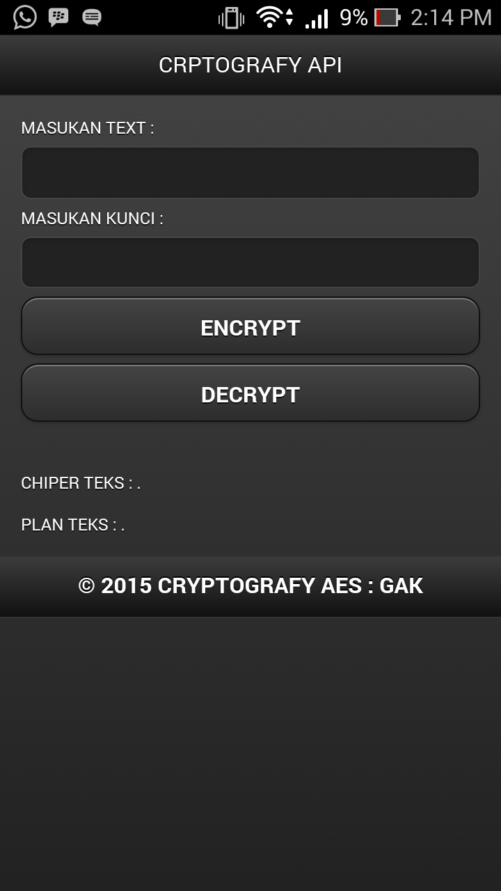

# cordova-plugin-cryptography-aes
do enkripsi and dekripsi using AES algorithm on Cordova 

### How to Use? ###

Use the plugin with Cordova CLI:

```cordova plugin add cordova-plugin-cryptography-aes```

# API Overview #

### Methods ###

```javascript
doEnkripsi(text, key, successCallback, failureCallback);

doDekripsi(text, key, successCallback, failureCallback);
```

### Quick Start ###

```bash
	# create a demo project
    cordova create test1 net.alkhansa.test1 Test1
    cd test1
    cordova platform add android
    
    # now add plugin
    cordova plugin add cordova-plugin-cryptography-aes
    
    # copy the demo file
    rm -r www/*; cp plugins/com.rjfun.cordova.sms/test/* www/;
    
	# now build and run the demo in your device or emulator
    cordova prepare; 
    cordova run android; 
    
    # or import into Xcode / eclipse
```

### Documentation ###

Check the [API Reference](https://github.com/floatinghotpot/cordova-plugin-sms/blob/master/docs/)

Check the [Example Code in test/index.html](https://github.com/gilangdipper/Plugin-Cordova-CryptographyAES/tree/master/docs/index.html).

### Demo ###



### Credits ###

The plugin is created and maintained by Gilang Al Khansa.

You can use it for FREE, it works in trial mode by default.

[A valid license](https://www.paypal.com/cgi-bin/webscr?cmd=_s-xclick&hosted_button_id=86JSRPJDQUMRU) is required to get email support, or use it in commercial product.


Project outsourcing and consulting service is also available. Please [contact us](http://floatinghotpot.github.io) if you have the business needs.

